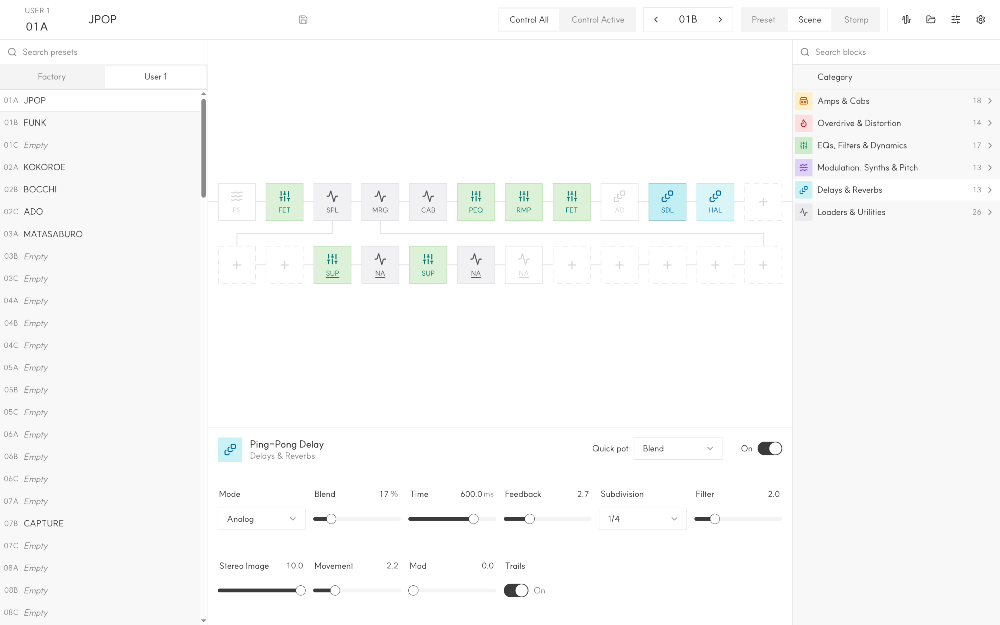

# Anagram Editor

A web editor for the Darkglass Anagram, built only from the public MIDI specification and from observing how the Darkglass Suite talks to the device over HID. It is not made by Darkglass Electronics.



Use it at <https://kimhappy.github.io/anagram-editor> with a Chromium-based browser and an Anagram on firmware 1.18 or newer plugged in over USB. The editor needs USB MIDI switched on in the device's MIDI settings.

## Build

The dev shell in `flake.nix` provides the Rust toolchain, Trunk and Tailwind.

```sh
nix develop
trunk serve
```

Open <http://127.0.0.1:8080>. Other commands:

| Task | Command |
| --- | --- |
| Release build into `dist/` | `trunk build --release` |
| Formatting | `cargo fmt --check` |
| Lints (browser build) | `cargo clippy --lib --bins -- -D warnings` |
| Lints (tests) | `cargo clippy --all-targets --target x86_64-unknown-linux-gnu -- -D warnings` |

## Tests

Unit tests run without an Anagram:

```sh
cargo test --lib --target x86_64-unknown-linux-gnu
cargo miri test --lib --target x86_64-unknown-linux-gnu
```

Device tests in `tests/device.rs` talk to a plugged-in Anagram over its `hidraw` node on Linux:

```sh
echo 'SUBSYSTEM=="hidraw", ATTRS{idVendor}=="2fa6", ATTRS{idProduct}=="2500", TAG+="uaccess"' | sudo tee /etc/udev/rules.d/70-anagram.rules
sudo udevadm control --reload

cargo test --test device --target x86_64-unknown-linux-gnu -- --ignored --test-threads=1
```

## Terms of use

Everything runs in your browser. The only thing the editor talks to is the Anagram plugged into your computer; no data is sent anywhere else.

Use it at your own risk. The authors take no responsibility for the device, its presets or its files.
